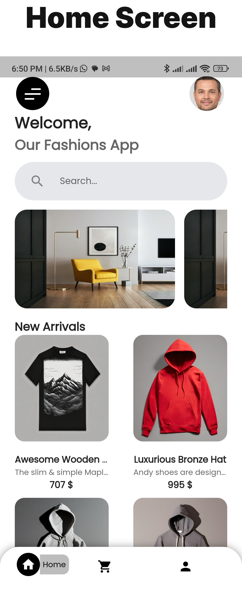
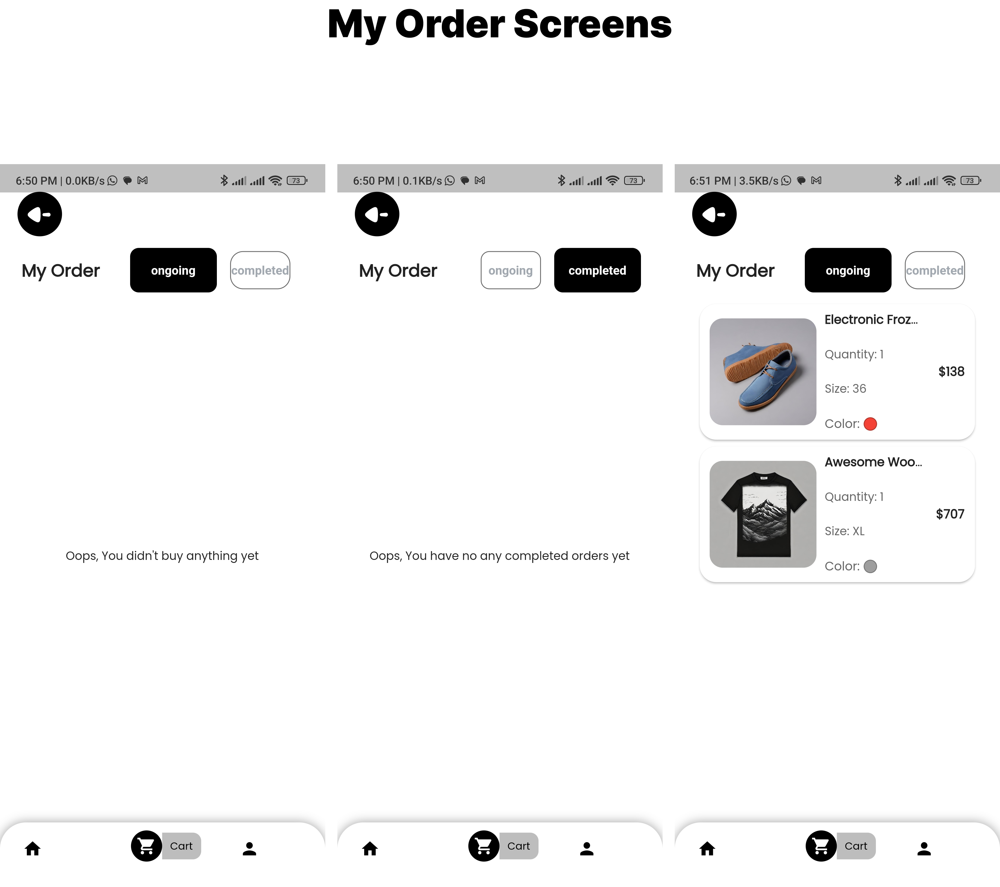
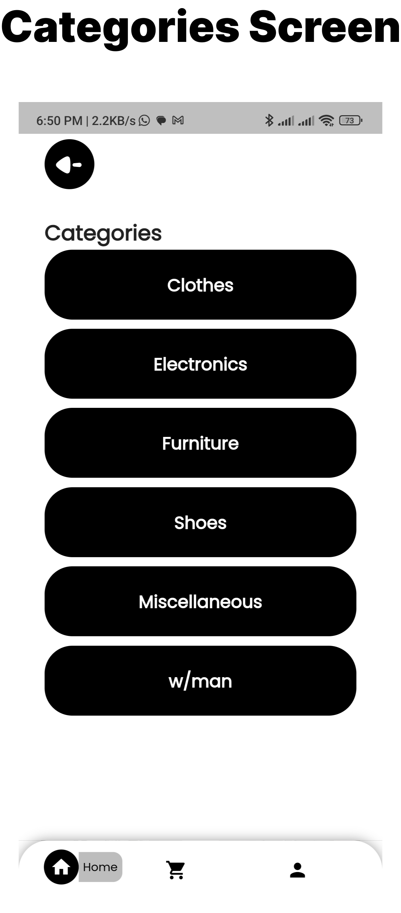
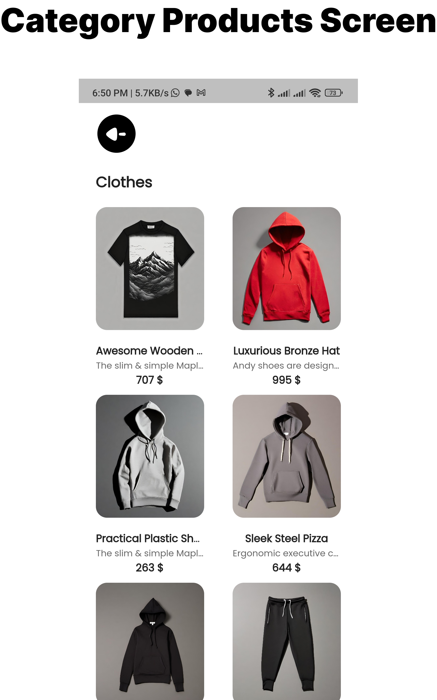
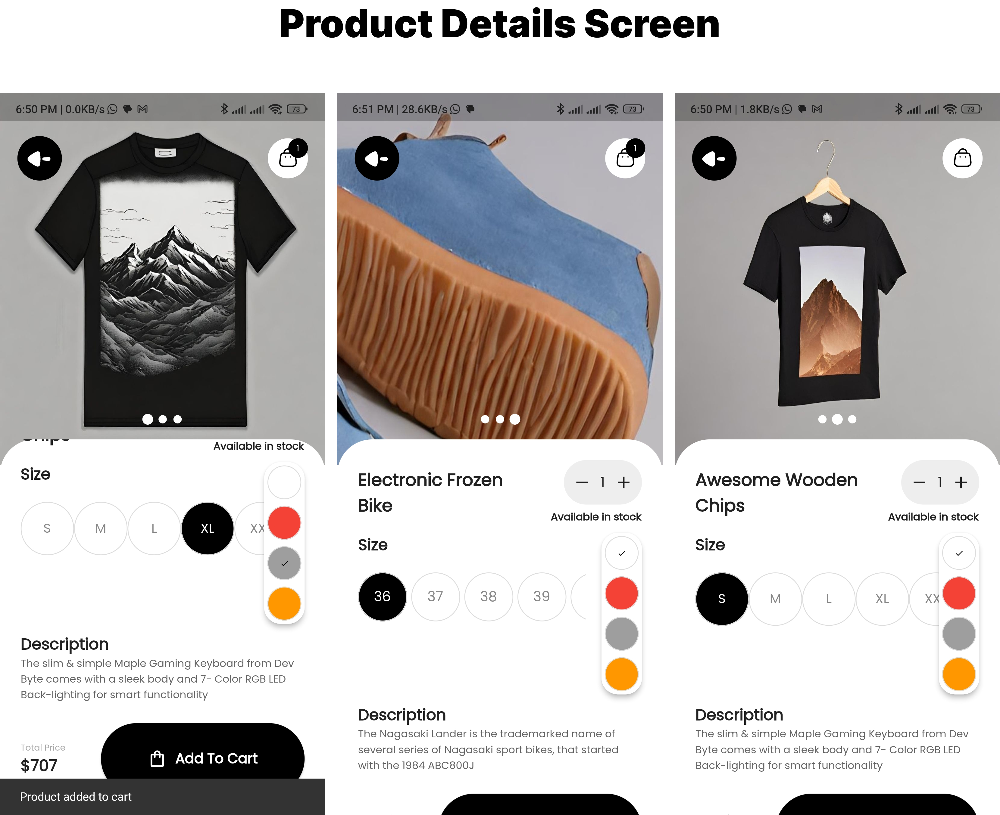
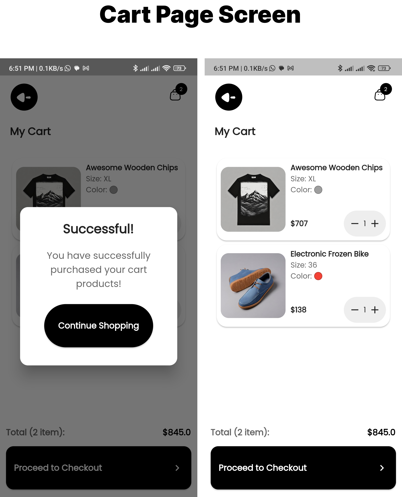

# Style Sphere

Welcome to Style Sphere App – a simple and stylish fashion app!

## Overview

**The App** is a cutting-edge mobile application built with Flutter, dedicated to offering users a seamless and enjoyable shopping experience for clothing items. Whether you're a fashion enthusiast or a shopper in search of the latest trends and styles, our app has you covered.

## Key Features

- **New Arrivals:** Stay on top of the fashion game with our regularly updated collection of new arrivals.

- **Category Products:** Explore a diverse range of clothing categories to find the perfect style that suits your taste.

- **Product Details:** Dive deeper into the details of each product, making informed decisions before adding them to your cart.

- **Cart Page:** Conveniently manage your chosen products in the cart, ensuring a hassle-free shopping journey.

- **Order History:** Keep track of your shopping history with the order history page, making it easy to revisit your favorite purchases.

## Screenshots














## User-Friendly Interface

With a user-friendly interface, Style Sphere is designed to make your shopping experience intuitive and enjoyable. From browsing new arrivals to managing your cart and checking your order history, every step is crafted to ensure a seamless journey.

Elevate your shopping experience with Style Sphere – where style meets convenience.

**Note:** The fake API is used solely for development and testing purposes. For production, consider integrating with a real API.

## Architecture and Code Organization

### Clean Architecture With Bloc State Management

#### Folder Structure

```root
\---style-sphere     
    +---assets
    |   +---icons
    |   |       back_arrow.svg
    |   |       cart.svg
    |   |       menu.svg
    |   |       
    |   \---images
    |           auth_background.png
    |           
    +---lib
    |   |   main.dart
    |   |   OnGenerateRoute.dart
    |   |   
    |   +---core
    |   |   +---constants
    |   |   |       api_constants.dart
    |   |   |       app_routes.dart
    |   |   |       string_constants.dart
    |   |   |       
    |   |   +---errors
    |   |   |       failure.dart
    |   |   |       
    |   |   +---functions
    |   |   |   |   service_locator.dart
    |   |   |   |   
    |   |   |   +---category_products_functions
    |   |   |   |       save_category_products_data.dart
    |   |   |   |       
    |   |   |   +---home_functions
    |   |   |   |       save_category_data.dart
    |   |   |   |       save_new_arrivals_data.dart
    |   |   |   |       
    |   |   |   +---product_details_functions
    |   |   |   |       save_product_category_data.dart
    |   |   |   |       save_product_details_data.dart
    |   |   |   |       
    |   |   |   \---profile_functions
    |   |   |           save_profile_data.dart
    |   |   |           
    |   |   +---use_cases
    |   |   |       no_param_use_case.dart
    |   |   |       use_case.dart
    |   |   |       
    |   |   +---utils
    |   |   |       shared_pref_service.dart
    |   |   |       simple_bloc_observer.dart
    |   |   |       
    |   |   \---widgets
    |   |           custom_column_show_product.dart
    |   |           custom_elevated_button_widget.dart
    |   |           custom_search_form_widget.dart
    |   |           custom_snack_bar_widget.dart
    |   |           custom_text_field_form_widget.dart
    |   |           custom_text_field_password_form_widget.dart
    |   |           
    |   \---features
    |       +---auth
    |       |   +---data
    |       |   |   +---data_sources
    |       |   |   |   +---login_data_source
    |       |   |   |   |   \---remote_data_source
    |       |   |   |   |           login_remote_data_source.dart
    |       |   |   |   |           
    |       |   |   |   \---sign_up_data_source
    |       |   |   |       \---remote_data_source
    |       |   |   |               sign_up_remote_data_source.dart
    |       |   |   |               
    |       |   |   +---models
    |       |   |   |   +---login_models
    |       |   |   |   |       login_model.dart
    |       |   |   |   |       
    |       |   |   |   \---sign_up_models
    |       |   |   |           check_email_model.dart
    |       |   |   |           sign_up_model.dart
    |       |   |   |           
    |       |   |   \---repositories
    |       |   |       +---login_repositories
    |       |   |       |       login_repo_impl.dart
    |       |   |       |       
    |       |   |       \---sign_up_repositories
    |       |   |               sign_up_repo_impl.dart
    |       |   |               
    |       |   +---domain
    |       |   |   +---entities
    |       |   |   |   +---login_entities
    |       |   |   |   |       login_entity.dart
    |       |   |   |   |       
    |       |   |   |   \---sign_up_entities
    |       |   |   |           check_email_entity.dart
    |       |   |   |           sign_up_entity.dart
    |       |   |   |           
    |       |   |   +---repositories
    |       |   |   |   +---login_repositories
    |       |   |   |   |       login_repo.dart
    |       |   |   |   |       
    |       |   |   |   \---sign_up_repositories
    |       |   |   |           sign_up_repo.dart
    |       |   |   |           
    |       |   |   \---use_cases
    |       |   |       +---login_use_cases
    |       |   |       |       fetch_token_use_case.dart
    |       |   |       |       
    |       |   |       \---sign_up_use_cases
    |       |   |               check_email_use_case.dart
    |       |   |               sign_up_use_case.dart
    |       |   |               
    |       |   \---presentation
    |       |       +---manager
    |       |       |   +---login_cubit
    |       |       |   |       login_cubit.dart
    |       |       |   |       login_state.dart
    |       |       |   |       
    |       |       |   \---sign_up_cubits
    |       |       |       +---check_email_cubit
    |       |       |       |       check_email_cubit.dart
    |       |       |       |       check_email_state.dart
    |       |       |       |       
    |       |       |       \---sign_up_cubit
    |       |       |               sign_up_cubit.dart
    |       |       |               sign_up_state.dart
    |       |       |               
    |       |       +---pages
    |       |       |       auth_page.dart
    |       |       |       login_page.dart
    |       |       |       sign_up_page.dart
    |       |       |       
    |       |       \---widgets
    |       |               auth_page_body.dart
    |       |               login_page_body.dart
    |       |               sign_up_page_body.dart
    |       |               
    |       +---cart
    |       |   +---data
    |       |   |   +---data_sources
    |       |   |   +---models
    |       |   |   \---repositories
    |       |   +---domain
    |       |   |   +---entities
    |       |   |   |       cart_item_entity.dart
    |       |   |   |       cart_product_entity.dart
    |       |   |   |       
    |       |   |   +---repositories
    |       |   |   \---use_cases
    |       |   \---presentation
    |       |       +---manager
    |       |       |   \---cart_cubit
    |       |       |           cart_cubit.dart
    |       |       |           
    |       |       +---pages
    |       |       |       cart_page.dart
    |       |       |       
    |       |       \---widgets
    |       |               cart_list_view.dart
    |       |               cart_list_view_bloc_builder.dart
    |       |               cart_list_view_item.dart
    |       |               cart_page_body.dart
    |       |               products_checkout_bloc_builder.dart
    |       |               
    |       +---category_products
    |       |   +---data
    |       |   |   +---data_sources
    |       |   |   |   +---local_data_source
    |       |   |   |   |       category_products_local_data_source.dart
    |       |   |   |   |       
    |       |   |   |   \---remote_data_source
    |       |   |   |           category_products_remote_data_source.dart
    |       |   |   |           
    |       |   |   +---models
    |       |   |   |       category_products_entity.dart
    |       |   |   |       
    |       |   |   \---repositories
    |       |   |           category_products_repo_impl.dart
    |       |   |           
    |       |   +---domain
    |       |   |   +---entities
    |       |   |   |       category_products_entity.dart
    |       |   |   |       category_products_entity.g.dart
    |       |   |   |       
    |       |   |   +---repositories
    |       |   |   |       category_products_repo.dart
    |       |   |   |       
    |       |   |   \---use_cases
    |       |   |           fetch_category_products_use_case.dart
    |       |   |           
    |       |   \---presentation
    |       |       +---manager
    |       |       |   \---category_products_cubit
    |       |       |           category_products_cubit.dart
    |       |       |           category_products_state.dart
    |       |       |           
    |       |       +---pages
    |       |       |       category_products_page.dart
    |       |       |       
    |       |       \---widgets
    |       |               category_products_grid_view.dart
    |       |               category_products_grid_view_bloc_builder.dart
    |       |               category_products_loading_grid_view.dart
    |       |               category_products_loading_grid_view_item.dart
    |       |               category_products_page_body.dart
    |       |               
    |       +---home
    |       |   +---data
    |       |   |   +---data_sources
    |       |   |   |   +---local_data_source
    |       |   |   |   |       home_local_data_source.dart
    |       |   |   |   |       
    |       |   |   |   \---remote_data_source
    |       |   |   |           home_remote_data_source.dart
    |       |   |   |           
    |       |   |   +---models
    |       |   |   |       category_model.dart
    |       |   |   |       new_arrivals_model.dart
    |       |   |   |       user_model.dart
    |       |   |   |       
    |       |   |   \---repositories
    |       |   |           home_repo_impl.dart
    |       |   |           
    |       |   +---domain
    |       |   |   +---entities
    |       |   |   |       category_entity.dart
    |       |   |   |       category_entity.g.dart
    |       |   |   |       new_arrivals_entity.dart
    |       |   |   |       new_arrivals_entity.g.dart
    |       |   |   |       user_entity.dart
    |       |   |   |       
    |       |   |   +---repositories
    |       |   |   |       home_repo.dart
    |       |   |   |       
    |       |   |   \---use_cases
    |       |   |           fetch_category_use_case.dart
    |       |   |           fetch_new_arrivals_use_case.dart
    |       |   |           fetch_user_use_case.dart
    |       |   |           
    |       |   \---presentation
    |       |       +---manager
    |       |       |   +---categories_cubit
    |       |       |   |       categories_cubit.dart
    |       |       |   |       categories_state.dart
    |       |       |   |       
    |       |       |   +---new_arrivals_cubit
    |       |       |   |       new_arrivals_cubit.dart
    |       |       |   |       new_arrivals_state.dart
    |       |       |   |       
    |       |       |   \---user_cubit
    |       |       |           user_cubit.dart
    |       |       |           user_state.dart
    |       |       |           
    |       |       +---pages
    |       |       |       home_page.dart
    |       |       |       
    |       |       \---widgets
    |       |               banner_list_view.dart
    |       |               banner_list_view_item.dart
    |       |               category_list_view.dart
    |       |               category_list_view_bloc_builder.dart
    |       |               category_list_view_item.dart
    |       |               category_loading_list_view.dart
    |       |               category_loading_list_view_item.dart
    |       |               home_avatar_cached_network_image_bloc_builder.dart
    |       |               home_drawer.dart
    |       |               home_page_body.dart
    |       |               news_arrival_loading_grid_view.dart
    |       |               news_arrival_loading_grid_view_item.dart
    |       |               new_arrival_grid_view.dart
    |       |               new_arrival_grid_view_bloc_builder.dart
    |       |               
    |       +---order
    |       |   +---data
    |       |   |   +---data_sources
    |       |   |   +---models
    |       |   |   \---repositories
    |       |   +---domain
    |       |   |   +---entities
    |       |   |   |       order_product_entity.dart
    |       |   |   |       
    |       |   |   +---repositories
    |       |   |   \---use_cases
    |       |   \---presentation
    |       |       +---manager
    |       |       |       order_cubit.dart
    |       |       |       
    |       |       +---pages
    |       |       |       order_page.dart
    |       |       |       
    |       |       \---widgets
    |       |               on_going_list_view.dart
    |       |               on_going_list_view_bloc_builder.dart
    |       |               on_going_list_view_item.dart
    |       |               order_page_body.dart
    |       |               
    |       +---product_details
    |       |   +---data
    |       |   |   +---data_sources
    |       |   |   |   +---local_data_source
    |       |   |   |   |       product_details_local_data_source.dart
    |       |   |   |   |       
    |       |   |   |   \---remote_data_source
    |       |   |   |           product_details_remote_data_source.dart
    |       |   |   |           
    |       |   |   +---models
    |       |   |   |       product_category_model.dart
    |       |   |   |       product_details_model.dart
    |       |   |   |       
    |       |   |   \---repositories
    |       |   |           product_details_repo_impl.dart
    |       |   |           
    |       |   +---domain
    |       |   |   +---entities
    |       |   |   |       product_category_entity.dart
    |       |   |   |       product_category_entity.g.dart
    |       |   |   |       product_details_entity.dart
    |       |   |   |       product_details_entity.g.dart
    |       |   |   |       
    |       |   |   +---repositories
    |       |   |   |       product_details_repo.dart
    |       |   |   |       
    |       |   |   \---use_cases
    |       |   |           fetch_product_details_use_case.dart
    |       |   |           
    |       |   \---presentation
    |       |       +---manager
    |       |       |   +---fetch_product_details_cubit
    |       |       |   |       fetch_product_details_cubit.dart
    |       |       |   |       fetch_product_details_state.dart
    |       |       |   |       
    |       |       |   +---product_color_cubit
    |       |       |   |       product_color_selector_cubit.dart
    |       |       |   |       
    |       |       |   +---product_quantity_cubit
    |       |       |   |       product_quantity_cubit.dart
    |       |       |   |       product_quantity_state.dart
    |       |       |   |       
    |       |       |   +---shirt_size_selector_cubit
    |       |       |   |       shirt_size_selector_cubit.dart
    |       |       |   |       
    |       |       |   \---shoes_size_selector_cubit
    |       |       |           shoes_size_selector_cubit.dart
    |       |       |           
    |       |       +---pages
    |       |       |       product_details_page.dart
    |       |       |       
    |       |       \---widgets
    |       |               product_color_selector.dart
    |       |               product_details_container.dart
    |       |               product_details_images.dart
    |       |               product_details_page_body.dart
    |       |               product_details_page_body_bloc_builder.dart
    |       |               product_quantity_bloc_builder.dart
    |       |               shirt_size_selector.dart
    |       |               shoes_size_selector.dart
    |       |               
    |       +---profile
    |       |   +---data
    |       |   |   +---data_sources
    |       |   |   |   +---local_data_source
    |       |   |   |   |       profile_local_data_source.dart
    |       |   |   |   |       
    |       |   |   |   \---remote_data_source
    |       |   |   |           profile_remote_data_source.dart
    |       |   |   |           
    |       |   |   +---models
    |       |   |   |       profileModel.dart
    |       |   |   |       
    |       |   |   \---repositories
    |       |   |           profile_repo_impl.dart
    |       |   |           
    |       |   +---domain
    |       |   |   +---entities
    |       |   |   |       profile_entity.dart
    |       |   |   |       profile_entity.g.dart
    |       |   |   |       
    |       |   |   +---repositories
    |       |   |   |       profile_repo.dart
    |       |   |   |       
    |       |   |   \---use_cases
    |       |   |           fetch_profile_use_case.dart
    |       |   |           
    |       |   \---presentation
    |       |       +---manager
    |       |       |       profile_cubit.dart
    |       |       |       profile_state.dart
    |       |       |       
    |       |       +---pages
    |       |       |       profile_page.dart
    |       |       |       
    |       |       \---widgets
    |       |               profile_button_row.dart
    |       |               profile_page_body.dart
    |       |               user_card_bloc_builder.dart
    |       |               
    |       +---root
    |       |   +---data
    |       |   |   +---data_sources
    |       |   |   +---models
    |       |   |   \---repositories
    |       |   +---domain
    |       |   |   +---entities
    |       |   |   +---repositories
    |       |   |   \---use_cases
    |       |   \---presentation
    |       |       +---manager
    |       |       |       bottom_navigation_cubit.dart
    |       |       |       
    |       |       +---pages
    |       |       |       root_page.dart
    |       |       |       
    |       |       \---widgets
    |       |               bottom_navigation_button.dart
    |       |               bottom_navigation_screen.dart
    |       |               
    |       \---settings
    |           +---data
    |           |   +---data_sources
    |           |   |   \---remote_data_source
    |           |   |           settings_remote_data_source.dart
    |           |   |           
    |           |   +---models
    |           |   |       update_user_model.dart
    |           |   |       
    |           |   \---repositories
    |           |           settings_repo_impl.dart
    |           |           
    |           +---domain
    |           |   +---entities
    |           |   |       update_user_entity.dart
    |           |   |       
    |           |   +---repositories
    |           |   |       settings_repo.dart
    |           |   |       
    |           |   \---use_cases
    |           |           update_user_use_case.dart
    |           |           
    |           \---presentation
    |               +---manager
    |               |   \---update_user_cubit
    |               |           update_user_cubit.dart
    |               |           update_user_state.dart
    |               |           
    |               +---pages
    |               |       settings_page.dart
    |               |       
    |               \---widgets
    |                       settings_avatar_cached_network_image.dart
    |                       settings_page_body.dart
    |                       user_data_input_row.dart
    |                       user_password_input_row.dart
    |                       
```
## Packages
- cupertino_icons: ^1.0.2
- google_fonts: ^6.1.0
- flutter_screenutil: ^5.9.0
- dartz: ^0.10.1
- equatable: ^2.0.5
- dio: ^5.3.4
- hive: ^2.2.3
- hive_flutter: ^1.1.0
- flutter_bloc: ^8.1.3
- get_it: ^7.6.4
- cached_network_image: ^3.3.0
- flutter_svg: ^2.0.9
- smooth_page_indicator: ^1.1.0
- shimmer: ^3.0.0
- shared_preferences: ^2.2.2
